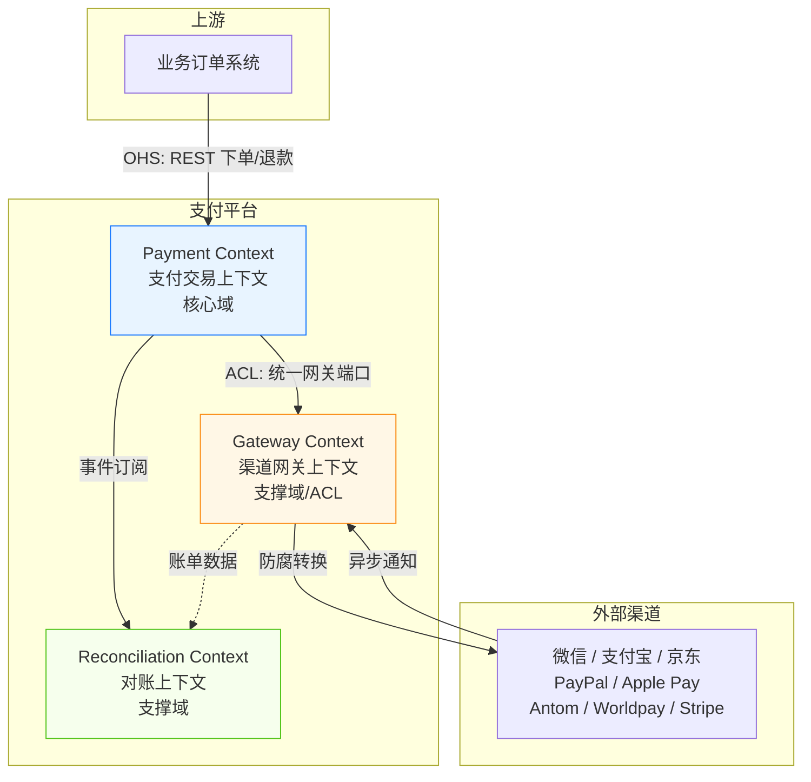
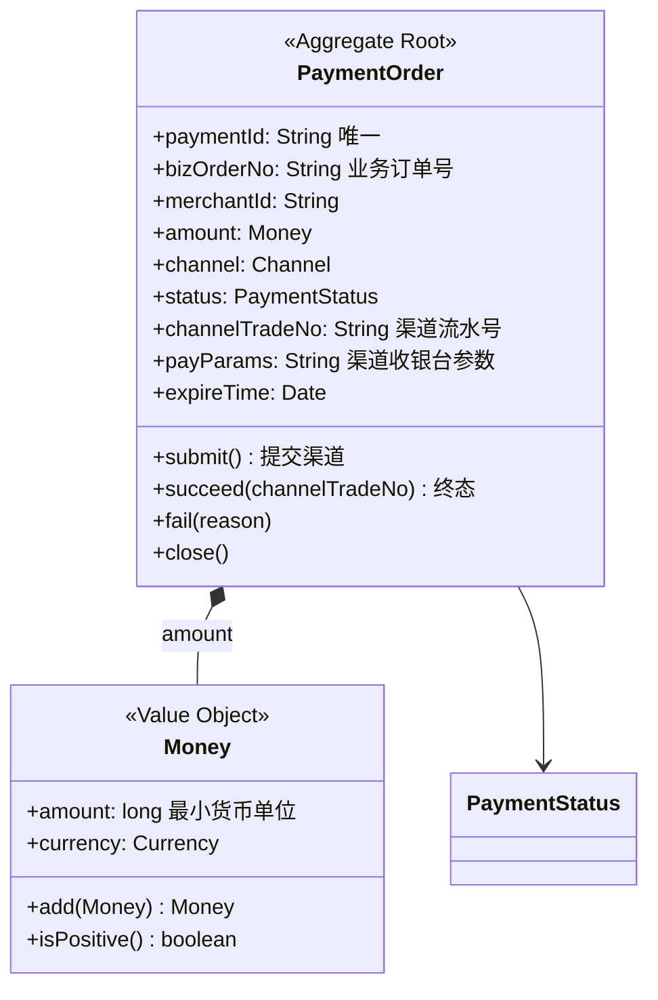
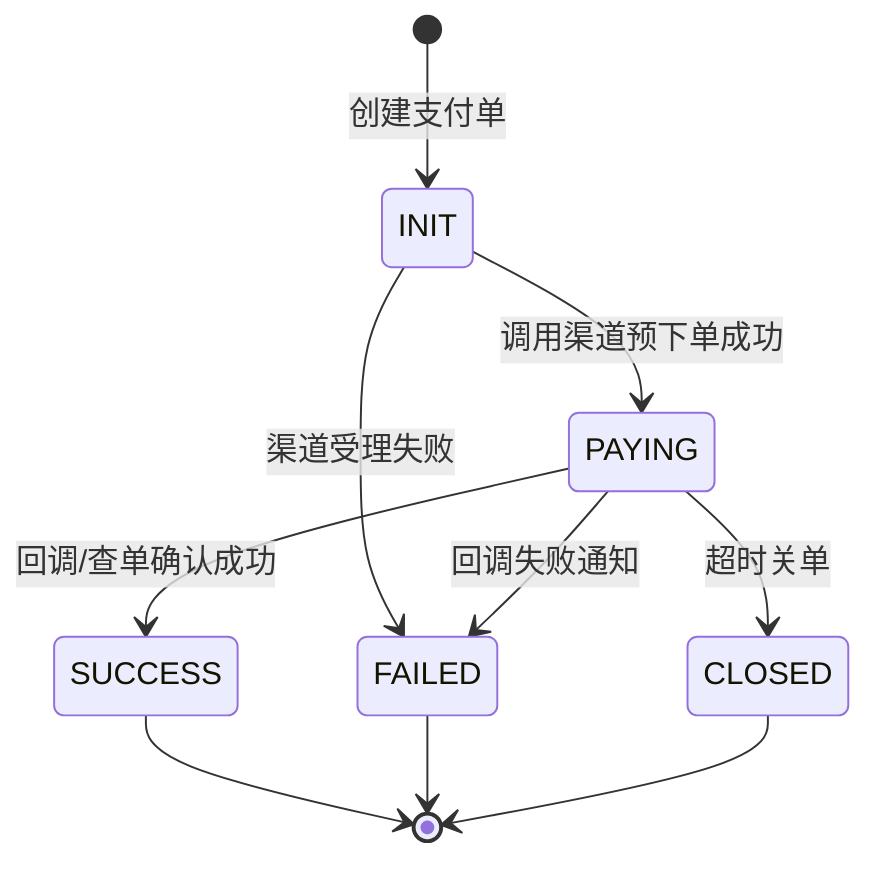
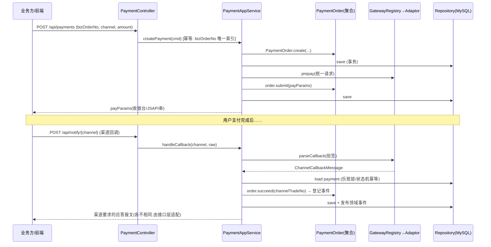

# 支付系统 DDD 设计文档（Demo）

> 范围：核心交易链路 —— 支付单、收单、渠道适配、回调/通知、退款、对账
> 技术栈：Java 17 + Spring Boot 3.x + Spring Data JPA + MySQL
> 工程形态：模块化单体（Modular Monolith），按 DDD 分层组织，预留向微服务拆分的边界

---

## 1. 战略设计（Strategic Design）

### 1.1 领域愿景与子域划分

支付系统本质上解决一个问题：**在买卖双方之间，通过第三方资金通道，安全、准确、可对账地完成资金流的转移，并保证信息流与资金流一致。**

按 DDD 子域分类法划分：

| 子域 | 类型 | 说明 |
|---|---|---|
| 支付交易（Payment） | **核心域** | 支付单/退款单的生命周期、状态机、金额规则，是系统的业务价值所在 |
| 渠道网关（Channel Gateway） | **支撑域** | 对接微信/支付宝/京东/PayPal/Apple Pay/Antom/Worldpay/Stripe，屏蔽差异 |
| 对账（Reconciliation） | **支撑域** | T+1 账单核对，发现单边账、长短款 |
| 商户/商品/订单（外部） | 通用域（泛化） | 本 Demo 中仅以 id 与金额体现，属于上游业务系统 |

### 1.2 限界上下文（Bounded Context）与上下文映射



| 关系 | 模式 | 说明 |
|---|---|---|
| 业务订单 → 支付 | Open Host Service (OHS) + Published Language | 支付平台对外暴露稳定的 REST API（收单/退款/关单/查询），契约以 DTO 固化 |
| 支付 → 渠道网关 | **Anticorruption Layer（防腐层）** | 领域层定义 `PaymentGateway` 端口，基础设施层各渠道适配器实现；渠道的金额单位、签名、报文格式绝不渗透进领域模型 |
| 支付 → 对账 | Published Language（领域事件） | 支付成功/退款完成等事件由对账上下文订阅，作为本地账基准 |
| 渠道 → 对账 | ACL | 渠道账单经 `BillDownloader` 端口转换为统一的 `BillRecord` 后参与核对 |

### 1.3 渠道差异调研结论（防腐层的依据）

| 维度 | 微信支付 | 支付宝 | 京东支付 | PayPal | Apple Pay | Antom | Worldpay | Stripe |
|---|---|---|---|---|---|---|---|---|
| 金额单位 | 分（int） | 元（字符串） | 分 | 元（字符串） | 按处理方 | 币种最小单位 | 分 | 分（int） |
| 签名/认证 | 商户证书+APIv3 | RSA2(SHA256) | RSA | OAuth2 | 依赖处理方(如Stripe) | 请求头签名 | TLS+证书 | Secret Key |
| 回调格式 | JSON | form 表单 | JSON | JSON(需验签) | — | JSON | XML/JSON | JSON |
| 回调应答 | `{"code":"SUCCESS"}` | `"success"` | 约定报文 | HTTP 200 | — | 约定报文 | HTTP 200 | HTTP 200 |
| 退款结果 | 异步回调 | 同步返回 | 异步 | 同步 | — | 异步通知 | 同步 | 同步 |
| 查单兜底 | 有 | 有 | 有 | 有 | — | 有 | 有 | 有 |
| 对账文件 | T+1 CSV | T+1 | T+1 | T+1 结算报告 | — | T+1 | T+1 | T+1 Balance Report |

> 结论：**流程相通（下单→支付→回调/查单→退款→对账），差异在细节**。因此采取"流程统一、差异下沉"策略：领域层只认统一模型，一切渠道私有语义在适配器内翻译。

---

## 2. 战术设计（Tactical Design）

### 2.1 聚合与实体

**聚合一：PaymentOrder（支付单聚合根）**



不变量（Invariant）：
- 金额必须为正，币种合法（`Money` 值对象构造时保证）
- 状态机单向流转：`INIT → PAYING → SUCCESS / FAILED / CLOSED`，终态不可再变更
- `SUCCESS` 后才允许创建退款，累计退款额 ≤ 支付额

**聚合二：RefundOrder（退款单聚合根）**

- `INIT → SUBMITTED → SUCCESS / FAILED`
- 关联 `paymentId`，金额受原支付单剩余可退金额约束（由领域服务校验跨聚合规则）

### 2.2 状态机



### 2.3 领域事件（聚合根内登记，应用层事务提交后发布）

| 事件 | 触发 | 消费方 |
|---|---|---|
| `PaymentOrderCreatedEvent` | 创建支付单 | 渠道路由审计、对账基准 |
| `PaymentSucceededEvent` | 支付成功 | 对账基准、上游通知 |
| `PaymentFailedEvent` / `PaymentClosedEvent` | 失败/关单 | 上游通知 |
| `RefundCreatedEvent` / `RefundSucceededEvent` | 退款创建/成功 | 对账基准 |

### 2.4 领域服务

- `GatewayRegistry`：按渠道枚举定位 `PaymentGateway` 实现（策略模式 + Spring 自动装配）
- `RefundDomainService`：跨聚合校验"可退金额 = 已支付 - 已退 - 退款中"，属于跨聚合规则故放在领域服务

### 2.5 防腐层端口（Ports，定义在领域层，实现在基础设施层）

```java
public interface PaymentGateway {
    Channel channel();
    GatewayPayResult prepay(GatewayPayRequest request);        // 统一下单
    GatewayQueryResult query(String paymentId);                 // 查单兜底
    ChannelCallbackMessage parseCallback(CallbackRequest raw);  // 验签+解析回调
    GatewayRefundResult refund(GatewayRefundRequest request);   // 退款
}

public interface BillDownloader {                                // 对账账单下载
    Channel channel();
    List<BillRecord> download(LocalDate billDate);
}
```

统一语义要点：金额统一为**最小货币单位 long**（在适配器内完成 分↔元 字符串换算）；回调统一解析为 `ChannelCallbackMessage`（验签在适配器内完成，未通过验签直接拒绝，绝不进入领域层）；渠道收银台参数（JSAPI 串 / 支付链接 / 收银台 URL）统一为 `payType + payData` 二元组。

### 2.6 通用语言（Ubiquitous Language）摘录

- **收单**：创建支付单并完成渠道预下单，拿到收银台/支付要素的过程
- **回调**：渠道异步通知支付结果；**查单**：主动查询兜底，防丢单边账
- **单边账**：我方成功但渠道失败（或反之），由对账发现
- **关单**：支付单超时未付，向渠道关闭，防止迟到扣款

---

## 3. 分层架构（Layered / Onion）

```mermaid
graph TB
    subgraph interfaces 接口层
        REST[REST 控制器 / DTO 组装]
    end
    subgraph application 应用层
        APP[应用服务: 编排用例, 无业务规则]
        CMD[Command / DTO]
    end
    subgraph domain 领域层 ★最稳定
        AGG[聚合根 PaymentOrder / RefundOrder]
        VO[值对象 Money / Channel / 状态]
        EVT[领域事件]
        DS[领域服务 GatewayRegistry / RefundDomainService]
        PORT[端口: PaymentGateway / BillDownloader / Repository 接口]
    end
    subgraph infrastructure 基础设施层
        ADP[8 个渠道适配器实现端口]
        JPA[JPA 仓储实现 / PO / 转换器]
    end

    REST --> APP
    APP --> AGG
    APP --> DS
    AGG --> PORT
    ADP -.实现.-> PORT
    JPA -.实现.-> PORT

    style domain fill:#e8f4ff,stroke:#1677ff
```

依赖规则：`interfaces → application → domain ← infrastructure`（依赖倒置）。**领域层不依赖 Spring Web/数据访问，只依赖 spring-context（事件机制），保证可单测。**

### 3.1 关键用例时序（收单 + 回调）



### 3.2 幂等与一致性设计

| 问题 | 方案 |
|---|---|
| 重复创建支付单 | `biz_order_no` 唯一索引 + 应用层捕获冲突返回已有单 |
| 回调重复投递 | 状态机幂等：终态收到回调直接返回成功应答，不重复发事件 |
| 回调与查单并发 | 聚合内乐观锁（`@Version`），后到者发现状态已终态则放弃 |
| 回调未达（掉单） | 定时任务对 PAYING 单调用 `query()` 主动查单（Demo 中留扩展点） |
| 退款超额 | 领域服务跨聚合校验 + 数据库层面累计退款金额校验 |
| 事件丢失 | Demo 用 Spring 事件；生产建议事务消息/本地消息表 |

---

## 4. 回调链路设计（核心参考链路）

回调链路是支付系统可靠性的生命线，本节给出完整闭环设计。

### 4.1 全链路时序

```mermaid
sequenceDiagram
    participant CH as 渠道(微信/支付宝/...)
    participant N as ChannelNotifyController
    participant A as ChannelCallbackAppService
    participant D as PaymentOrder(聚合)
    participant LOG as ChannelCallbackLog(留痕)
    participant DB as Repository(MySQL)
    participant L as UpstreamNotifyService<br/>(AFTER_COMMIT 监听)
    participant T as MerchantNotifyTask
    participant BIZ as 上游业务方

    CH->>N: POST /api/notify/{channel} (原始报文)
    N->>A: handleCallback(CallbackRequest)
    A->>LOG: ① 原始报文全量留痕(验签失败也留)
    A->>A: ② gateway.parseCallback 验签+解析(防腐层)
    A->>DB: load payment
    A->>D: ③ succeed(tradeNo, paidAmount)
    Note over D: 金额不变量聚合内校验<br/>终态幂等: 重复回调直接忽略
    A->>DB: save (乐观锁) + 登记领域事件
    A->>LOG: ④ 处理结果留痕(SUCCESS/IGNORED/...)
    A-->>N: ChannelCallbackMessage
    N-->>CH: ⑤ 渠道差异化应答(微信JSON/支付宝success/...)

    Note over A,BIZ: —— 事务提交后 ——
    A--)L: AFTER_COMMIT: PaymentSucceededEvent
    L->>T: 创建通知任务(WAITING)落库
    L->>BIZ: HTTP POST payload(带签名头)
    BIZ-->>L: "success" → task SUCCESS
    Note over L,T: 失败→指数退避 1/5/15/30/60min 重试，耗尽→EXHAUSTED

    Note over CH,DB: —— 掉单补偿(并行护栏) ——
    participant J as PaymentCompensationJob(@Scheduled)
    J->>DB: 扫描 PAYING 单
    J->>A: queryAndSyncPayment 查单兑底
    J->>D: 超时未付 → close()
end
```

### 4.2 机制逐项说明

| 环节 | 机制 | DDD 归属 |
|---|---|---|
| 验签解析 | 适配器内验签，产出统一 `ChannelCallbackMessage`，签名不通过抛 `GatewayException` | 防腐层(基础设施实现端口) |
| 回调留痕 | `ChannelCallbackLog` 全量落库（含验签失败/订单不存在/金额不一致），支撑争议仲裁与回放 | 审计支撑组件(非聚合) |
| 幂等 | 状态机守护：终态收到重复回调直接返回成功应答；乐观锁防并发竞争 | 聚合不变量 |
| 金额核对 | 「确认金额=应付金额」在 `PaymentOrder.succeed(tradeNo, paidAmount)` 内校验，破坏则抛 `AmountMismatchException` | 聚合不变量 |
| 状态推进 | 应用层只调行为方法，不得直接改状态字段 | 聚合是状态机唯一拥有者 |
| 事件发布 | 聚合内登记 → 应用层发布 → AFTER_COMMIT 监听，保证「先落库后通知」。事务用 TransactionTemplate 编程式包裹「状态推进段」：验签失败留痕留在事务外（避免随异常回滚），事件在事务内发布以触发 AFTER_COMMIT | 领域事件 |
| 上游通知 | `MerchantNotifyTask` 任务化(WAITING→SUCCESS/EXHAUSTED)，指数退避重试，at-least-once(上游需幂等) | 领域实体+应用服务编排 |
| 通知签名 | `UpstreamNotifier` 端口实现带 HMAC 签名头，防伪造 | 防腐层 |
| 掉单补偿 | `PaymentCompensationJob` 定时扫描 PAYING 单：查单兑底同步状态；超时未付关单（`isExpired` 判定在聚合） | 应用服务+定时触发器 |
| 应答适配 | 接口层按渠道渲染应答报文（微信 `{"code":"SUCCESS"}` / 支付宝 `success` / 其他 200） | 接口层职责 |

### 4.3 演示闭环

业务方下单时将 `merchantNotifyUrl` 填为 `http://localhost:8080/api/mock/merchant-notify`，
支付成功后可在该模拟端点日志中观察到通知报文；关停模拟端点即可演示重试与 EXHAUSTED。

---

## 5. 分层职责总览（DDD 元素映射）

### 5.1 依赖规则

```
interfaces ──▶ application ──▶ domain ◀── infrastructure
```

- 领域层只依赖 spring-context（事件机制），不依赖 Web/JPA，可脱离容器单测
- 端口（Repository/PaymentGateway/BillDownloader/UpstreamNotifier）定义在领域层，实现在基础设施层（依赖倒置）
- 应用层不出现 if/else 业务规则；出现即视为信号，应下沉到聚合或领域服务

### 5.2 各层职责清单

| 层 | 职责 | 本工程对应类 | 禁止事项 |
|---|---|---|---|
| interfaces 接口层 | 协议适配（HTTP↔Command/DTO）、渠道差异化应答渲染、全局异常翻译 | Payment/Refund/ChannelNotify/ReconciliationController、GlobalExceptionHandler | 不含业务规则；不直接访问领域对象 |
| application 应用层 | 用例编排：事务边界、幂等控制、调防腐层端口、发布领域事件、留痕编排 | PaymentAppService、RefundAppService、ChannelCallbackAppService、ReconciliationAppService、UpstreamNotifyService | 不写状态机/核对规则等业务规则 |
| domain 领域层 | 聚合状态机、不变量守护、跨聚合规则、领域事件、端口定义 | PaymentOrder、RefundOrder、MerchantNotifyTask、Money、RefundDomainService、ReconciliationDomainService、GatewayRegistry、PaymentGateway/UpstreamNotifier(端口) | 不依赖框架/存储/HTTP；不写编排 |
| infrastructure 基础设施层 | 端口实现：渠道适配(验签/金额换算/报文翻译)、JPA 仓储、上游 HTTP 通知、定时触发器 | 8×Gateway、RestUpstreamNotifier、各 RepositoryImpl、PaymentCompensationJob、NotifyRetryJob | 不定义业务规则；渠道私有语义不得上浮 |

### 5.3 DDD 战术元素映射

| DDD 元素 | 本工程落地 |
|---|---|
| 聚合根 | `PaymentOrder`(支付单，含状态机/事件登记/金额不变量/isExpired)、`RefundOrder`(退款)、`ReconciliationBatch`(对账批次) |
| 实体 | `ReconciliationItem`(批次内差异实体)、`ChannelCallbackLog`(留痕实体)、`MerchantNotifyTask`(通知任务实体) |
| 值对象 | `Money`(不可变，最小货币单位+币种换算)、枚举 `Channel/Currency/PaymentStatus/...` |
| 领域服务 | `RefundDomainService`(跨聚合可退额校验)、`ReconciliationDomainService`(双向核对规则)、`GatewayRegistry`(策略路由) |
| 领域事件 | 聚合内登记(pendingEvents) → 应用层发布 → AFTER_COMMIT 消费(上游通知)；事件即对账上下文的 Published Language |
| 仓储 | 领域层定义接口(PaymentOrderRepository 等4个)，JPA 实现于基础设施层；PO 与聚合双向转换(Converter) |
| 防腐层 ACL | `PaymentGateway`/`BillDownloader`/`UpstreamNotifier` 端口 + 8 渠道适配器：验签、金额单位换算(分↔元↔最小单位)、报文翻译、异常翻译(GatewayException) |
| 通用语言 | 收单/回调/查单/关单/掉单/单边账/可退金额 —— 贯穿类名、方法名、事件名、文档 |

### 5.4 本次自查修正记录

- 对账双向核对规则从 `ReconciliationAppService` 下沉到 `ReconciliationDomainService`（应用层不含业务规则）
- 关单时机判定收敛为聚合方法 `PaymentOrder.isExpired()`（替代基础设施内联比较）
- 回调金额核对从应用服务下沉到 `PaymentOrder.succeed(tradeNo, paidAmount)`（不变量归聚合守护）

---

## 6. 对账上下文设计

- `ReconciliationBatch`（聚合）：一次 T+1 批次（渠道 + 日期），状态 `INIT → DOWNLOADING → CHECKING → DONE`
- 流程：下载渠道账单（`BillDownloader` 端口）→ 与本地已成功支付/退款记录逐笔核对 → 产出差异项 `ReconciliationItem`（类型：我方多/渠道多/金额不一致）
- 差异处理：Demo 落库告警；生产中接人工工单或自动补单（以渠道为准调 `query()` 拉平状态）

---

## 7. 工程结构（对应代码骨架）

```
payment-ddd-demo
├── docs/architecture-design.md          # 本文档
├── pom.xml
└── src/main
    ├── java/com/example/payment
    │   ├── domain                       # 领域层（无框架依赖）
    │   │   ├── shared                   # 共享内核: Money/Channel/Currency
    │   │   ├── gateway                  # ACL 端口与统一报文模型
    │   │   ├── payment                  # 支付聚合/退款聚合/事件/留痕/通知任务/仓储接口
    │   │   ├── reconciliation           # 对账聚合
    │   │   └── service                  # 领域服务(退款校验/对账核对/网关注册表)
    │   ├── application                  # 应用层（用例编排）
    │   │   ├── command / dto
    │   │   └── service                  # Payment/Refund/Callback/Reconciliation/UpstreamNotify 应用服务
    │   ├── infrastructure               # 基础设施层
    │   │   ├── gateway                  # 8 渠道适配器 + 网关属性配置
    │   │   ├── notify                   # 上游通知 HTTP 实现
    │   │   ├── schedule                 # 掉单补偿/通知重试定时任务
    │   │   └── persistence              # JPA PO / 仓储实现 / 领域↔PO 转换
    │   └── interfaces                   # 接口层
    │       └── rest                     # 控制器 / 回调应答适配
    └── resources
        ├── application.yml
        └── schema.sql
```

## 8. 演进路线（Demo → 生产）

1. 渠道适配器接真实 SDK（Demo 为 mock 实现，`MockChannelClient` 留位）
2. 事件改本地消息表 + MQ（RocketMQ/Kafka），保证"落库与发事件"最终一致
3. 增加渠道路由域（按费率/限额/成功率动态选路）、风控上下文、渠道路由灰度
4. 对账自动差异处理 + 清结算上下文（分账、结算单、发票）
5. 多租户/多商户隔离，敏感数据加密（PCI-DSS：卡信息不过自己服务器，优先托管收银台模式）
